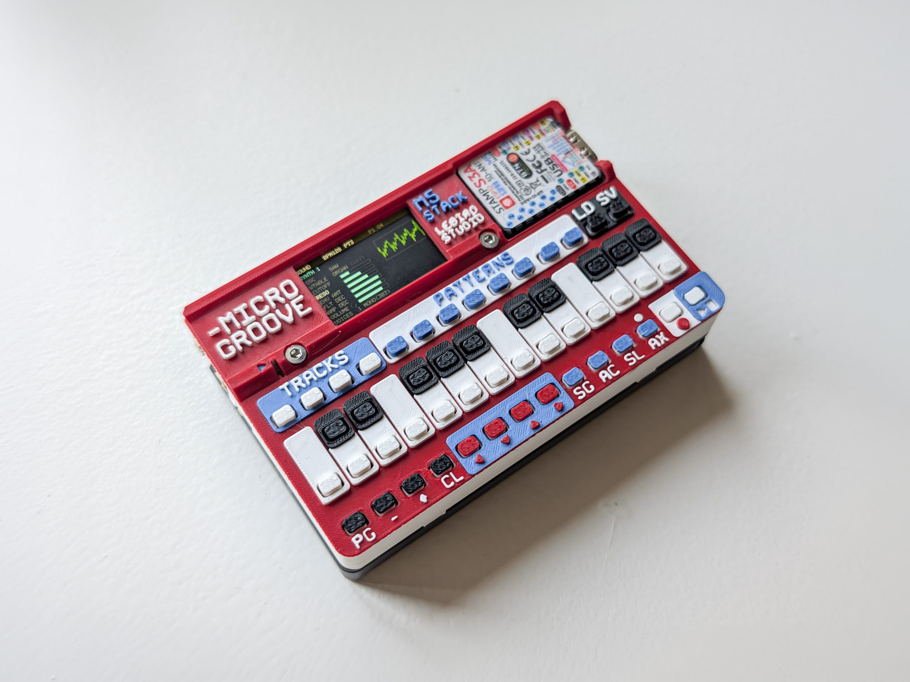
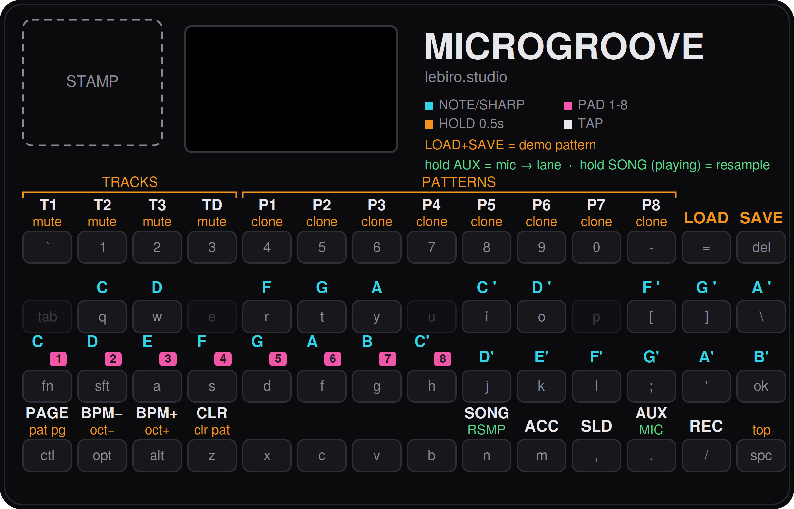

<p align="center">
  
</p>

# Microgroove

**A wallet-sized groovebox that turns $30 of hardware and a 3D printer into a four-track acid powerhouse.**

Firmware for the **M5Stack Cardputer-ADV**, by [lebiro.studio](https://lebiro.studio).

**Print it. Flash it. Jam.**

[](LICENSE)
[](https://ko-fi.com/makarov87)

## What it does

- **3 synth tracks** — each switchable between a **mono 303-style voice**
  (saw/square/tri/sine/wavetable → resonant SVF filter, **accent** and **slide**)
  and **2–3-voice polyphony**. Overlapping notes record a *slide* in mono, a *chord* in poly.
- **8 drum lanes** — each independently **808 synthesis**, **909 synthesis**, or
  **SD sample playback**; per-lane volume, tune (±12 st), decay, and **choke groups**
  (909 open/closed hats choke by default).
- **Live mic sampling** — hold one key; the footer becomes a level meter. Release to
  auto-trim, write to SD, and play it on a drum lane instantly (max ~2.6 s).
- **Resampling** — hold SONG while playing to bounce ~1.9 s of the master mix onto any pad.
- **Sequencer** — 8 patterns × 16 steps, hold-to-clone, bar-quantized pattern switching,
  live record with quantize / step-write / hold-to-erase.
- **Song mode** — 64-slot pattern chain with loop point.
- **User wavetables** — drop single-cycle WAVs (AKWF) on the card; they appear as oscillators.
- **8 project slots** on microSD; sampled sounds reload with projects by filename.
- **One key = one function** — hold any orange-labeled key 0.5 s for its second function,
  with a progress bar so nothing fires by accident. The note keys mirror a **real piano layout**,
  E–F and B–C gaps included.

Full feature tour and guides: **[docs/USER_MANUAL.md](docs/USER_MANUAL.md)**

## Get it running

Pick whichever flashing route suits you — all three are on the
[Releases](../../releases) page.

**Option 1 — pre-built binary:** grab `microgroove.bin` (a merged image) and
flash it to offset `0x0` with esptool
(`esptool.py write_flash 0x0 microgroove.bin`) or any ESP32-S3 flashing tool.

**Option 2 — Arduino IDE (from the release zip):** download
`Microgroove_source.zip`, unzip it (keep the folder named `Microgroove`), open
`Microgroove.ino`, install the **M5Cardputer** library (pulls in M5Unified/M5GFX),
select the *M5Cardputer* board (or ESP32S3 Dev Module with USB CDC on boot), and
Upload. A `HOW_TO_FLASH.txt` is included in the zip.

**Option 3 — build from source (this repo):** clone it and open `Microgroove.ino`
in the Arduino IDE, or use PlatformIO:

```ini
[env:m5stack-cardputer]
platform = espressif32@6.7.0
board = esp32-s3-devkitc-1
framework = arduino
build_flags = -DESP32S3 -DARDUINO_USB_CDC_ON_BOOT=1 -DARDUINO_USB_MODE=1
lib_deps = M5Cardputer=https://github.com/m5stack/M5Cardputer
```

**Then, for the demo + samples:** copy either the release's
`Microgroove_SD_card.zip` contents or [`factory-sd/groovebox/`](factory-sd/) to
the root of a FAT32 microSD. Power on → hold **LOAD** → tap **SONG** → **PLAY**.
No card? Hold **LOAD+SAVE** together for a built-in demo.

## The shell

Print files, keycap label sheet (v6), and assembly guide:
**MakerWorld** <!-- TODO: link --> · **Printables** <!-- TODO: link --> · [`hardware/`](hardware/)

## Keys at a glance

<p align="center">
  
</p>

`T1 T2 T3 TD` select tracks (hold = mute) · `P1–P8` select patterns (hold = clone) ·
the note keys are a piano (whites on the home row, sharps above, E–F/B–C gaps dead),
and the first eight white keys become pads 1–8 when the drum track is selected.
Orange = the hold (0.5 s) function; green = the sampling holds. `AUX` held samples
the mic, `SONG` held while playing resamples the mix. The HELP page shows this map
on the device; the [manual](docs/USER_MANUAL.md) explains every key.

## Architecture

```
Microgroove.ino     setup / main loop (core 1: input, sequencer, UI)
audio_engine.cpp    render task (core 0), dual buffer -> Speaker.playRaw
synth_voice.h       303-style voice (osc + SVF + envelopes)
sequencer.h/.cpp    SynthTrack (1-3 voice alloc), patterns, transport, live record
drum_voice.h        808/909 synthesis + per-lane engine/choke logic
sampler.cpp         WAV decode -> 192 KB RAM pool, playback voices
mic_sampler.cpp     mic capture + engine resampling -> SD/pool
wavetable.cpp       8 built-in tables + user single-cycle WAVs
storage.cpp         GBX v2 project files (loads v1 transparently)
input.cpp           keyboard snapshot diffing -> short/long-press dispatch
ui.cpp              5 pages, sprite double-buffered
keymap.h            every key assignment in one file
```

All firmware files live in the repo root next to `Microgroove.ino` (Arduino
sketch layout) — open the folder in the Arduino IDE and it picks them all up.

22.05 kHz, 256-sample buffers, all voices rendered per-sample into a soft-clipped
mix on core 0. Project files are versioned: v2 stores chords and per-track VOICES;
v1 files load transparently (and become v2 on the next save).

## License & lineage

MIT — see [LICENSE](LICENSE). The synth voice, 808 drum synthesis, and audio task
architecture are derived from
[Cardputer-Adv-Tracker](https://github.com/qwertyuu/Cardputer-Adv-Tracker) by
**qwertyuu** (MIT), substantially redesigned into a different instrument. The
factory sample pack is **CC0** by lebiro.studio.

If Microgroove earns a place on your desk: [Ko-fi](https://ko-fi.com/makarov87) ☕
